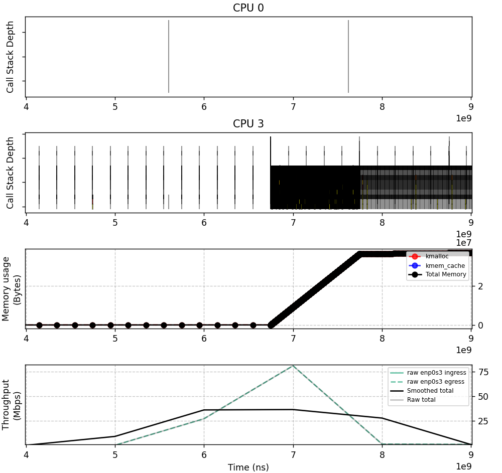
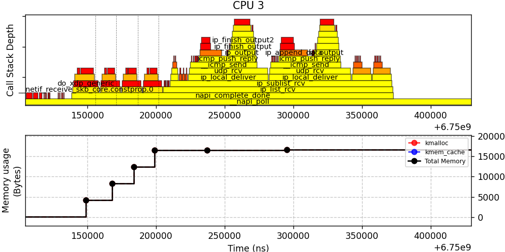

> [!WARNING]
> This is a PhD project, and it is still very WIP.

# aya-network-deep-profiling

High granularity Linux kernel-space and user-space network profiling.

De-zoomed


Zoomed


## Prerequisites

### Aya

1. stable rust toolchains: `rustup toolchain install stable`
2. nightly rust toolchains: `rustup toolchain install nightly --component rust-src`
3. (if cross-compiling) rustup target: `rustup target add ${ARCH}-unknown-linux-musl`
4. (if cross-compiling) LLVM: (e.g.) `brew install llvm` (on macOS)
5. (if cross-compiling) C toolchain: (e.g.) [`brew install filosottile/musl-cross/musl-cross`](https://github.com/FiloSottile/homebrew-musl-cross) (on macOS)
6. bpf-linker: `cargo install bpf-linker` (`--no-default-features` on macOS)

### This application

1. A valid Linux image, likely built with `scripts/create_debian_guest.sh`
2. `patchelf` bin (https://github.com/droidian/patchelf)
3. QEMU x86_64
4. Route between the host and the guest `ip route add 10.0.1.0/24 via 192.168.179.2`

## Develop

### 1. Set compilation flags

Add needed compilation flags in `aya-network-deep-profiling` such as:
```toml
[features]
default = []
user-space-program = ["aya-network-deep-profiling-common/user-space-program"]
```

`aya-network-deep-profiling-common`
```toml
[features]
default = []
user-space-program = []
```

And the compilation flags are also in place in the `default` section of the `aya-network-deep-profiling-ebpf` crate like:
```toml
[features]
default = ["user-space-program"]
user-space-program = ["aya-network-deep-profiling-common/user-space-program"]
```

### 2. Add the functions to profile

Add the fonctions to profile in the following enums of `aya-network-deep-profiling-common/src/lib.rs`

```rust
pub enum KernelFunction {
    /// Manages forwarding of packets not destined for the local host, applying routing decisions.
    ip_forward,
    /// Some doc
    my_kernel_function
}

#[cfg_attr(any(feature = "user-space-program"), repr(u16))]
pub enum UserFunction {
    #[cfg(feature = "user-space-program")]
    main => "/root/my_bin",
}
```

## Build & Run

### 1. Run the build script

```shell
./build.sh
```

or with compilation flags

```shell
./build.sh user-space-program
```

### 2. Run the VM

Launch it with the `scripts/launch_guest.sh` script.
- If the VM image was built with `scripts/create_debian_guest.sh`, log in with
  - user: `root`
  - password `debian`
  - and you are good to go!
- Else, log in, run `scripts/guest/mount_shared_folder.sh` and `scripts/guest/ip_config.sh` inside the guest.

### 3. Run the application

If the previous step was done successfully, you should see the `aya-network-deep-profiling` bin in the guest's `shared` folder.

Run the application. It can be ended with `ctrl-c` or by sending a `SIGINT`.

```shell
./shared/aya-network-deep-profiling -vv -t > shared/output.txt
```

Now, every marked function will be profiled.

> [!WARNING]
> Since the Linux kernel is *really fast*, 10 seconds of data can take up to 20 minutes to process after ending the application.

### 4. Plot the results

Use `flameline.py` to plot the results

E.g.
```shell
python flameline.py -s+ -m -t -x -f='1000000000-2000000000'
```

Help:
```shell
usage: FlameLine [-h] [-i INPUT] [-s] [-s+] [-m] [-t] [-x] [-f FILTER]
                 [--ignored-cpus IGNORED_CPUS [IGNORED_CPUS ...]] [--xdp-labels] [--no-stack-labels]
                 [--vertical-label VERTICAL_LABEL] [--visible-threshold VISIBLE_THRESHOLD]

options:
  -h, --help            show this help message and exit
  -i INPUT, --input INPUT
                        Data to plot, default is "shared/results.json"
  -s, --stack-merged    Plot the call stack with merged CPUs
  -s+, --stack-per-cpu  Plot a call stack for each CPU
  -m, --memory          Plot the memory usage
  -t, --throughput      Plot the throughput
  -x, --xdp             Plot XDP packet reception
  -f FILTER, --filter FILTER
                        Filter time in nanoseconds, e.g. "1000000000-2000000000" for data only from 1s to 2s
  --ignored-cpus IGNORED_CPUS [IGNORED_CPUS ...]
                        Hide specific CPUs in plot
  --xdp-labels          Show ethernet header for XDP packets
  --no-stack-labels     Do not plot function labels in the call stack
  --vertical-label VERTICAL_LABEL
                        Maximum function length in nanoseconds to make its label vertical
  --visible-threshold VISIBLE_THRESHOLD
                        Width percentage of a function needed to plot its label
```

## License

With the exception of eBPF code, aya-network-deep-profiling is distributed under the terms
of either the [MIT license] or the [Apache License] (version 2.0), at your
option.

Unless you explicitly state otherwise, any contribution intentionally submitted
for inclusion in this crate by you, as defined in the Apache-2.0 license, shall
be dual licensed as above, without any additional terms or conditions.

### eBPF

All eBPF code is distributed under either the terms of the
[GNU General Public License, Version 2] or the [MIT license], at your
option.

Unless you explicitly state otherwise, any contribution intentionally submitted
for inclusion in this project by you, as defined in the GPL-2 license, shall be
dual licensed as above, without any additional terms or conditions.

[Apache license]: LICENSE-APACHE
[MIT license]: LICENSE-MIT
[GNU General Public License, Version 2]: LICENSE-GPL2
